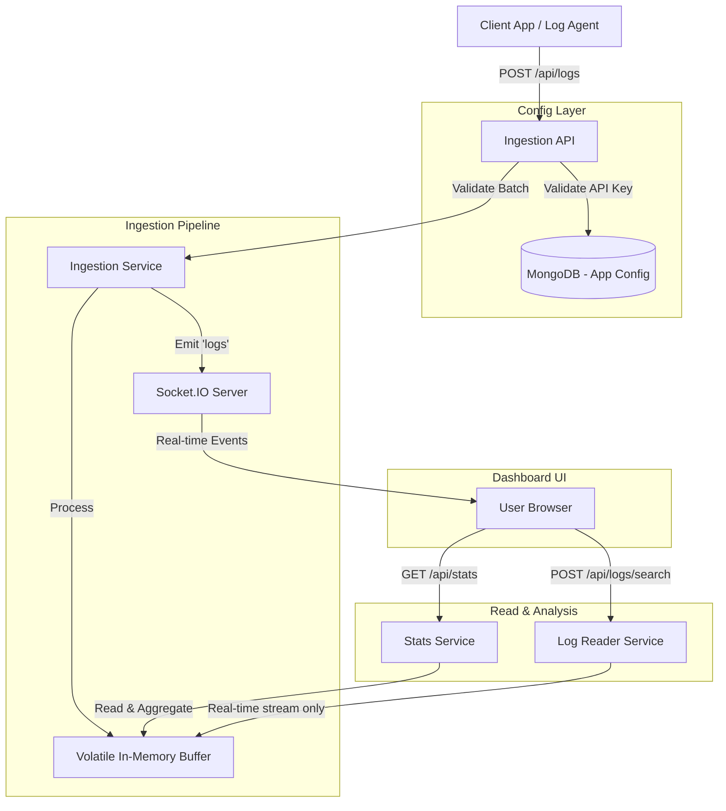

# System Data Flow

This document describes how data moves through the Log Monitoring Application, from ingestion to visualization and storage.

## Architecture Overview

The system follows a volatile, near-real-time data flow for ingestion designed to be compatible with Serverless environments (like Vercel). Persistent storage is exclusively used for core application configurations.

## Detailed Flow Components

### 1. Application Configuration
- **Mechanism**: MongoDB
- **Purpose**: Stores application data including identifiers and API Keys necessary for authentication when ingesting external logs.

### 2. Log Ingestion
- **EntryPoint**: `POST /api/logs`
- **Authentication**: API Key validation against the `AppModel` stored in MongoDB.
- **Processing**: `src/services/ingestionService.ts` receives log batches.
- **Validation**: Each log is validated strictly against the predefined `Log` schema.
- **Buffering**: Valid logs are pushed to an in-memory `volatileHistory` buffer (`src/lib/buffer.ts`), bounded to the latest 2000 logs per application constraint to preserve memory. Disk persistence (e.g. NDJSON writes) has been completely removed to avoid `read-only` file system constraints in Serverless deployments (e.g., on Vercel).

### 3. Real-time Streaming
- **Mechanism**: Socket.IO
- **Trigger**: Emitted immediately upon successful ingestion and validation of a log batch.
- **Pathway**: `ingestionService` -> `socket.ts` -> Emit `logs` event -> Connected Clients.
- **Latency**: Near real-time (instantaneous WebSocket pushes).

### 4. Data Retrieval & Analysis
- **Stats API**: `GET /api/stats`
    - **Service**: `src/services/statsService.ts`
    - **Operation**: Periodically reads historical segments from the `volatileHistory` in-memory ring-buffer.
    - **Processing**:
        - Filters logs based on the requested time range bounds available in memory.
        - Aggregates metrics (Logs/sec, Error Rate, Avg Latency).
        - Generates distribution patterns (Timeline, Service and Level charts).
        - **Anomaly Detection**: Runs heuristics entirely on the in-memory window to detect traffic spikes or error burst intervals and synthesize system alerts.
- **Log Explorer**: `POST /api/logs/search`
    - **Service**: `src/lib/logReader.ts`
    - **Operation**: Operates in volatile mode, heavily deferring and prioritizing active viewing to live stream ingestion transmitted by Socket.IO directly to the frontend.

## Storage Schema
- **Applications**: Stored persistently in **MongoDB**, using Mongoose schemas.
- **Logs**: **Volatile (In-Memory)** limits recent history to 2000 logs maximum per app to cap memory usage dynamics. Storage to disk is disabled.
